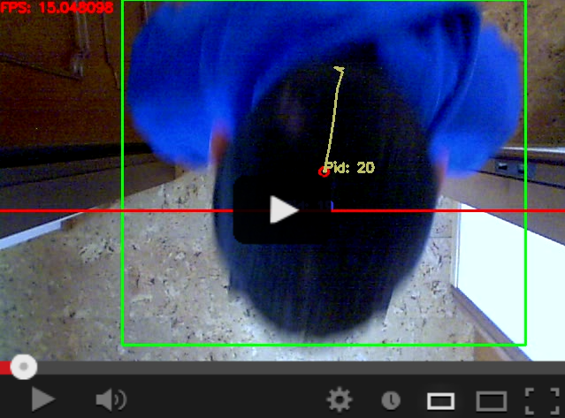

# Passenger Counter (PCN)
This is going to be my Electronics Engineering Master's Thesis.

<p align="center">
<a href="https://www.youtube.com/watch?v=YkER1yEFgEs"></a>
</p>

### Goal
Developing a Passenger Counter (PCN) in a transportation environment using OpenCV and its hardware acceleration capabilities on different hardware platforms.

### Hardware
* Eurotech ReliGATE 20-25 (Intel E3827 Atom Processor)

Video acquisition:
* Logitech Quickcam Pro 5000 driverless webcam

### Software platform
[Here](https://github.com/mattdibi/RSPassengerCounter/tree/master/build_config) you can find the instructions for building the Yocto distribution supporting the PCN application. It is needed to run the application on Eurotech's ReliaGate 20-25.

### Tools
For the development I've used:
* Yocto Project
* OpenCV

## User guide

**Build C++ version**
```sh
$ cmake .
$ make
$ ./PCN
```

**Build C++ poky version**
```sh
$ ./X-COMPILE-OCV
```
### Options
```sh
    - Without arguments: it opens the default webcam and captures the input stream.
-s  - Capture mode: it saves the color stream on file.
```

### Runtime commands
```
r: resetting counters
p: get passenger count
c: toggle display color
C: toggle display calibration
b: toggle display background subtraction view
d: toggle display denoised view
q: exit program
h: display help message
```

